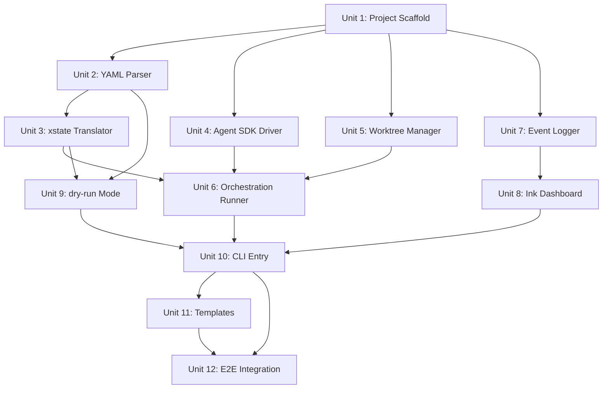

# feat: Maestro M1 Engine Core

> 实现状态：当前代码库已完成 M1。本文件保留为原始 M1 执行计划，下面的 checkbox 是历史计划状态，不代表实时进度。当前进度请以 `docs/roadmap.md` 为准。

## Overview

Build the core orchestration engine for Maestro — a tool that reads YAML paradigm files, translates them into xstate v5 state machines, and executes AI agent phases sequentially with git worktree isolation. M1 goal is internal use: replace the manual 6-step Superpowers + Compound Engineering workflow with `maestro run combined-workflow.yaml --task "..."`.

## Problem Frame

The developer currently runs a 6-step AI-assisted R&D workflow manually: brainstorm → lock knowledge → deep plan → execute → review → compound learnings. Each step requires copy-pasting commands, waiting for completion, and manually passing context between steps. Maestro automates this by encoding the methodology as a state machine and orchestrating agent execution through phases. (see origin: docs/brainstorms/2026-04-03-maestro-roadmap-requirements.md)

## Requirements Trace

- R1. Parse agents-first-class YAML paradigm files (agents + phases + handoff_routing)
- R2. Validate required fields, agent references, routing constraints, circular reference detection
- R4. `--dry-run` mode: parse and simulate state machine without launching agents
- R5. xstate v5 state machine: linear flow (next), conditional routing (next_if), retry loops
- R6. Translate YAML to xstate `createMachine()` config with dynamic guards
- R7. Read output_file YAML frontmatter `status` field to drive conditional routing
- R8. Unmatched status values enter FAILED state with clear error message
- R9. Claude Code driver module with AgentEvent types (output/complete/error) — formal AgentDriver interface deferred to M2
- R10. Claude Code driver via Agent SDK (`@anthropic-ai/claude-agent-sdk`)
- R12. Git worktree management: persistent per-phase worktrees, reuse across retries, cleanup on completion
- R13. File-copy handoff: detect changes via `git diff --name-status`, copy to next phase worktree
- R14. Prompt template interpolation: `{{task}}`, `{{previous_output}}` (empty string for first phase)
- R15. Knowledge base writes handled by agent via prompt instructions — engine does not manage
- R16. Phase timeout: default 5 min, configurable via `timeout_s`, timeout → FAILED
- R17. Max retries: `max_retries` config, exceed → abort with summary
- R18. Directory anchoring: agent subprocess cwd fixed to its worktree
- R19. Prompt size protection: >100KB → write to temp file
- R20-R22. Simple Ink UI: phase progress bar, agent stdout stream, per-phase timer
- R23. Event logging: `events.jsonl` (MaestroEvent format)
- R24. Auto-generated run report: `.maestro/reports/run-{timestamp}.md`
- R25. CLI: `maestro run <paradigm.yaml> --task "..." [--dry-run]`
- R26. Ctrl-C graceful exit: terminate agents + cleanup worktrees
- R27-R29. Paradigm templates: tdd-strict.yaml, combined-workflow.yaml, prompts/

## Scope Boundaries

- M1 only supports Claude Code driver (via Agent SDK) — no multi-driver
- M1 only supports serial phase execution — no parallel/fork-join
- M1 is not published to npm — runs locally via bun
- Engine does not manage knowledge base writes — agent handles via prompt instructions
- No natural language paradigms — YAML only
- No GUI adapter (Cursor etc.) — CLI agents only
- R3 (schema version field) and R11 (extensible driver interface) deferred to M2 — M1 has one user and one driver (see origin: Key Decisions)

## Context & Research

### Relevant Code and Patterns

- `docs/templates/claude-team.yaml` — Real-world 3-agent team definition with system_prompt, tools, handoff_routing. The YAML parser must support this structure.
- `docs/templates/combined-workflow.md` — The 6-step workflow being automated. Each step maps to a paradigm phase.

### External References

- **xstate v5**: `setup()` accepts dynamically built guards/actors objects. `createMachine()` accepts dynamic config. Pattern B (invoke + onDone) recommended for async agent execution. Use `as any` for TypeScript dynamic guards.
- **Claude Agent SDK**: `@anthropic-ai/claude-agent-sdk` provides `query()` async iterator. Supports `cwd`, `allowedTools`, `permissionMode`, `maxTurns`, `maxBudgetUsd`, `systemPrompt`. Returns typed messages (`ResultMessage`, `SystemMessage`, `AssistantMessage`).
- **Ink v5**: `<Static>` + dynamic area pattern. `useReducer` for event-driven state. `Bun.spawn()` compatible. Need `process.stdin.resume()` workaround for Bun. Circular buffer for stdout lines.

## Key Technical Decisions

- **Agent SDK over subprocess**: Research confirmed `@anthropic-ai/claude-agent-sdk` provides typed async iteration, native cwd control, tool restrictions, and budget limits. Eliminates stdout parsing complexity. M2 drivers (codex, gemini, aider) will still use subprocess spawning through a generic interface. (see origin: Outstanding Questions — R10 spike resolved)

- **xstate v5 with dynamic guards (Pattern B)**: Each phase becomes an `invoke` actor. On completion, the engine reads the output_file status and updates context. `always` transitions with guards route to the next phase. Guards are dynamically generated from YAML `next_if` blocks. TypeScript types use `as any` for dynamic portions. (see origin: Outstanding Questions — R6 spike resolved)

- **Status matching is case-insensitive with normalization**: To handle LLM output variability, status values from output_file frontmatter are lowercased and trimmed before matching against `next_if` keys. This prevents `Approved` vs `approved` mismatches causing spurious FAILED states.

- **No AgentDriver interface in M1**: With only one driver (Agent SDK), defining an abstract interface is speculative. M1 implements the Claude Code driver as a concrete module. The driver interface will be extracted in M2 when the second driver is introduced. (overrides R9/R11 — see origin: document review finding #7)

- **Worktree isolation retained for M1**: Despite serial execution, worktrees prevent residual state pollution between phases and enable clean `git diff` for handoff detection. The complexity cost is acceptable given git worktree is a well-understood primitive.

- **Retry loop handoff**: When Review rejects and routes back to Execute, the engine passes Review's output_file content as `{{previous_output}}` in Execute's prompt. Execute's worktree retains its previous code state — the agent receives feedback and continues from where it left off.

- **Output file error handling**: Missing output_file → FAILED. Present but no YAML frontmatter → FAILED. Present but no `status` field → FAILED. All with descriptive error messages naming the expected file and format.

## Open Questions

### Resolved During Planning

- **xstate v5 dynamic guards**: Confirmed viable. `setup({ guards: dynamicGuards }).createMachine(dynamicConfig)` works. Use `as any` for type safety escape hatch. Reference: statelyai/xstate#4788.
- **Claude Code subprocess behavior**: `--output-dir` does not exist. Agent SDK is the recommended alternative. `query()` returns typed messages via async iterator. `options.cwd` controls working directory.
- **YAML schema fields**: Derived from `claude-team.yaml` template. Agents have `description`, `driver`, `system_prompt_file`/`system_prompt`, `tools`. Phases have `agent`, `prompt_file`, `output_file`, `next`/`next_if`, `timeout_s`, `max_retries`, `type`.

### Deferred to Implementation

- Exact error message text and formatting for validation failures
- Optimal circular buffer size for Ink stdout display (start with 200 lines, tune based on usage)
- Run report markdown template content and structure
- Prompt template content for each phase in combined-workflow.yaml (quality depends on iterative testing)
- Worktree cleanup on SIGKILL — M1 will add a stale worktree detector on startup that cleans up orphaned `.maestro/worktrees/` entries

## High-Level Technical Design

> *This illustrates the intended approach and is directional guidance for review, not implementation specification. The implementing agent should treat it as context, not code to reproduce.*

### State Machine Translation (YAML → xstate v5)

```
YAML paradigm file
    │
    ▼
┌─────────────────────────────┐
│  Parser: yaml.parse()       │  → ParadigmConfig object
│  Validator: check refs,     │     (agents, phases, routing)
│    routing, cycles          │
└─────────────┬───────────────┘
              │
              ▼
┌─────────────────────────────┐
│  Translator                 │
│                             │
│  For each phase:            │
│    • Create invoke actor    │  → calls Agent SDK query()
│    • Create routing guards  │  → status === "approved" etc.
│    • Build state config     │  → { invoke, onDone, always }
│                             │
│  Register in setup():       │
│    guards: { ...dynamic }   │
│    actors: { ...dynamic }   │
└─────────────┬───────────────┘
              │
              ▼
┌─────────────────────────────┐
│  setup(guards, actors)      │
│    .createMachine(config)   │
│                             │
│  createActor(machine)       │
│    .start()                 │
└─────────────────────────────┘
```

### Phase Execution Flow

```
Phase starts
    │
    ├─ Create/reuse worktree for this phase
    ├─ Copy changed files from previous phase (if any)
    ├─ Assemble prompt: read prompt_file, interpolate {{task}} + {{previous_output}}
    ├─ Emit PHASE_START event
    │
    ▼
Agent SDK query()
    │
    ├─ Stream messages → Ink dashboard (live stdout)
    ├─ On each message → emit AGENT_OUTPUT event
    │
    ▼
Agent completes (ResultMessage received)
    │
    ├─ Read output_file from worktree
    ├─ Parse YAML frontmatter → extract status
    ├─ Normalize status (lowercase, trim)
    │
    ├─ If status matches next_if key → route to target phase
    ├─ If status unmatched → FAILED with error
    ├─ If output_file missing/invalid → FAILED with error
    │
    ├─ Emit PHASE_COMPLETE event (with duration, status)
    │
    ▼
Next phase or Done
```

### Event Architecture

```
All engine actions emit MaestroEvent → EventLogger
    │
    ├─ events.jsonl  (append-only, one JSON per line)
    ├─ Ink dashboard  (real-time rendering)
    │
    ▼ (on pipeline completion)
    ReportGenerator reads events.jsonl → .maestro/reports/run-{ts}.md
```

## Implementation Units

### Dependency Graph



Units 2, 4, 5, 7 can be developed in parallel after Unit 1.

---

- [ ] **Unit 1: Project Scaffold**

**Goal:** Initialize the TypeScript project with bun, install dependencies, set up directory structure and build config.

**Requirements:** Foundation for all other units

**Dependencies:** None

**Files:**
- Create: `package.json`
- Create: `tsconfig.json`
- Create: `src/index.ts` (empty entry)
- Create: `src/types.ts` (shared type definitions)
- Create: `.gitignore`

**Approach:**
- `bun init` with TypeScript
- Install core deps: `xstate`, `ink`, `react`, `@anthropic-ai/claude-agent-sdk`, `yaml`, `commander`
- Install dev deps: `@types/react`, `bun-types`, `ink-testing-library`
- Directory structure: `src/{engine,driver,dashboard,sandbox,cli}/`
- Configure tsconfig for strict mode, JSX react-jsx (for Ink)

**Patterns to follow:**
- Standard bun TypeScript project structure

**Test expectation:** none — pure scaffolding

**Verification:**
- `bun run src/index.ts` executes without error
- All imports resolve

---

- [ ] **Unit 2: YAML Parser + Validator**

**Goal:** Parse agents-first-class YAML paradigm files and validate their structure.

**Requirements:** R1, R2

**Dependencies:** Unit 1

**Files:**
- Create: `src/engine/parser.ts`
- Create: `src/engine/validator.ts`
- Create: `src/engine/types.ts` (ParadigmConfig, AgentConfig, PhaseConfig types)
- Test: `tests/engine/parser.test.ts`
- Test: `tests/engine/validator.test.ts`

**Approach:**
- `parser.ts`: Use `yaml` package to parse YAML string into raw object, then map to typed `ParadigmConfig`
- `validator.ts`: Validate required fields, agent reference integrity (phase.agent must exist in agents section), handoff_routing legality (routing targets must be valid agents), circular reference detection (graph cycle detection on phase transitions)
- YAML schema supports: `name`, `description`, `agents` (with `description`, `driver`, `system_prompt_file`/`system_prompt`, `tools`), `phases` (with `agent`, `prompt_file`, `output_file`, `next`/`next_if`, `timeout_s`, `max_retries`, `type`), `handoff_routing`
- Output_file is required for all non-final phases (validator enforces this)
- Optional `maestro_version` field: if absent, default to "1". If present and not "1", reject with "Unsupported paradigm version" error (forward-compatibility guard for M2)
- File path resolution: `prompt_file` and `system_prompt_file` paths in YAML resolved relative to the paradigm file's directory, not CWD. Parser stores paradigm file directory and uses it for resolution
- Return descriptive errors with field path and expected value

**Patterns to follow:**
- `docs/templates/claude-team.yaml` as the reference YAML structure

**Test scenarios:**
- Happy path: Parse valid paradigm with 3 agents, 6 phases, handoff_routing → returns typed ParadigmConfig
- Happy path: Parse minimal paradigm with 1 agent, 2 phases, no routing → succeeds
- Edge case: Phase references nonexistent agent → validation error naming the phase and missing agent
- Edge case: handoff_routing references nonexistent agent → validation error
- Edge case: Circular phase references (A→B→A with no final state and no max_retries) → detected and rejected
- Edge case: Phase missing required output_file (non-final) → validation error
- Error path: Malformed YAML (syntax error) → descriptive parse error with line info
- Error path: Missing required fields (no phases section) → validation error listing missing fields
- Edge case: next_if targets nonexistent phase → validation error

**Verification:**
- All test scenarios pass
- Parser correctly handles both `system_prompt_file` and inline `system_prompt`
- Validator catches all reference integrity violations

---

- [ ] **Unit 3: xstate State Machine Translator**

**Goal:** Translate a validated ParadigmConfig into an xstate v5 state machine with dynamic guards and invoked actors.

**Requirements:** R5, R6, R7, R8

**Dependencies:** Unit 2

**Files:**
- Create: `src/engine/machine.ts`
- Create: `src/engine/guards.ts`
- Test: `tests/engine/machine.test.ts`

**Approach:**
- For each phase with `next_if`: generate named guards that compare `context.lastStatus` against each key (case-insensitive, trimmed)
- For each non-final phase: create an `invoke` state that calls a placeholder actor (the real agent execution is wired in Unit 6)
- On invoke completion (`onDone`): assign `event.output.status` to `context.lastStatus`, then transition to a routing sub-state
- Routing sub-state uses `always` transitions with guards to select the target phase
- For phases with simple `next`: direct transition on invoke completion
- Final phases: `type: 'final'`
- `max_retries`: tracked in context per-phase (`context.retries[phaseName]`), guard checks count before allowing retry transition — exceeds → transition to `__FAILED` terminal state
- `timeout_s`: not in xstate — handled by the orchestration runner (Unit 6) wrapping invoke in a timeout

**Technical design:**
> *Directional guidance, not implementation specification.*

```
// Pseudo-code for translator
function translateToMachine(config: ParadigmConfig) {
  guards = {}
  actors = {}
  states = {}

  for each (phaseName, phase) in config.phases:
    if phase.type === "final":
      states[phaseName] = { type: "final" }
      continue

    actorName = `run_${phaseName}`
    actors[actorName] = fromPromise(async () => placeholder)

    if phase.next_if:
      // Generate guards for each condition
      for (status, target) in phase.next_if:
        guardName = `${phaseName}_is_${status}`
        guards[guardName] = ({ context }) =>
          context.lastStatus.toLowerCase().trim() === status.toLowerCase()

      // Create routing state
      states[`${phaseName}_routing`] = {
        always: [
          ...phase.next_if.map((status, target) => ({
            guard: guardName, target
          })),
          // Fallback: unmatched status → FAILED
          { target: "__FAILED" }
        ]
      }

      states[phaseName] = {
        invoke: { src: actorName, onDone: {
          actions: assign lastStatus from output,
          target: `${phaseName}_routing`
        }}
      }
    else:
      states[phaseName] = {
        invoke: { src: actorName, onDone: { target: phase.next }}
      }

  return setup({ guards, actors }).createMachine({
    initial: firstPhaseName,
    context: { lastStatus: "", retries: {} },
    states: { ...states, __FAILED: { type: "final" } }
  })
}
```

**Patterns to follow:**
- xstate v5 `setup()` + `createMachine()` pattern
- `fromPromise()` for async actors

**Test scenarios:**
- Happy path: Linear 3-phase paradigm (A→B→C→Done) → machine transitions correctly through all states
- Happy path: Conditional routing (Review with next_if approved→Done, rejected→Implement) → correct routing based on status
- Edge case: Status matching is case-insensitive ("Approved" matches "approved" guard)
- Edge case: Status with whitespace (" approved ") matches after trim
- Edge case: Unmatched status value → transitions to __FAILED state
- Edge case: max_retries exceeded → transitions to __FAILED instead of retry
- Happy path: max_retries not exceeded → allows retry transition
- Integration: Full combined-workflow paradigm (6 phases) → generates valid machine with correct topology

**Verification:**
- Machine created from tdd-strict paradigm correctly models the 3-phase TDD loop
- Machine created from combined-workflow paradigm correctly models 6 phases with Review→Execute rejection loop
- __FAILED state is reachable from every conditional phase

---

- [ ] **Unit 4: Claude Code Driver (Agent SDK)**

**Goal:** Implement the Claude Code driver using the Agent SDK, providing async iteration of agent events.

**Requirements:** R10

**Dependencies:** Unit 1

**Files:**
- Create: `src/driver/claude.ts`
- Create: `src/driver/types.ts` (AgentEvent type)
- Test: `tests/driver/claude.test.ts`

**Approach:**
- Import `query` from `@anthropic-ai/claude-agent-sdk`
- `runAgent(prompt, workdir, options)` returns `AsyncIterableIterator<AgentEvent>`
- AgentEvent types: `{ type: 'output', text: string }`, `{ type: 'complete', result: string, sessionId: string }`, `{ type: 'error', error: Error }`
- Map Agent SDK messages to AgentEvent: `AssistantMessage` → output, `ResultMessage` → complete, errors → error
- Options: `systemPrompt` (from agent config), `allowedTools` (from agent config), `maxTurns` (configurable), `permissionMode: "bypassPermissions"` (unattended execution)
- Use `options.cwd` to set the working directory to the phase worktree

**Patterns to follow:**
- Agent SDK `query()` async iterator pattern from research

**Test scenarios:**
- Happy path: runAgent with simple prompt → receives output events followed by complete event with result
- Error path: Agent SDK throws CLINotFoundError → wrapped as AgentEvent error
- Edge case: Agent produces no output (empty result) → complete event with empty result string
- Happy path: systemPrompt and allowedTools correctly passed to query options

**Verification:**
- Can spawn a Claude Code agent in a specified directory and receive streaming output
- Error conditions are properly caught and surfaced as AgentEvent errors

---

- [ ] **Unit 5: Worktree Manager + Handoff**

**Goal:** Manage git worktree lifecycle and implement file-copy handoff between phases.

**Requirements:** R12, R13, R14, R18, R19

**Dependencies:** Unit 1

**Files:**
- Create: `src/sandbox/worktree.ts`
- Create: `src/sandbox/handoff.ts`
- Create: `src/sandbox/prompt.ts`
- Test: `tests/sandbox/worktree.test.ts`
- Test: `tests/sandbox/handoff.test.ts`
- Test: `tests/sandbox/prompt.test.ts`

**Approach:**
- **worktree.ts**: Create worktrees under `.maestro/worktrees/{run-id}/{phase-name}/`. Reuse across retries (same phase, same worktree). Cleanup: remove all worktrees for a run on completion. On startup: detect and clean stale worktrees from crashed runs.
- **handoff.ts**: After phase A completes, run `git diff --name-status` in A's worktree to detect changes (additions, modifications, deletions, renames). Copy changed files to phase B's worktree. Deletions propagated as `rm`. Renames treated as delete+add.
- **prompt.ts**: Read prompt_file, replace `{{task}}` with CLI --task value, replace `{{previous_output}}` with content of previous phase's output_file (empty string for first phase). If assembled prompt exceeds 100KB, write to temp file and pass file path.
- Directory anchoring: all git/file operations scoped to worktree path, never parent directories

**Test scenarios:**
- Happy path: Create worktree → directory exists with repo content
- Happy path: Reuse worktree across retries → same directory, content preserved
- Happy path: Cleanup removes all worktrees for a run
- Happy path: File-copy handoff detects added, modified, deleted files correctly
- Edge case: Handoff with rename → treated as delete + add
- Edge case: First phase has no previous output → `{{previous_output}}` replaced with empty string
- Happy path: Prompt interpolation replaces `{{task}}` and `{{previous_output}}` correctly
- Edge case: Prompt exceeds 100KB → written to temp file
- Edge case: Stale worktree from crashed run → cleaned up on startup
- Error path: git worktree create fails (e.g., dirty state) → descriptive error

**Verification:**
- Can create, reuse, and cleanup worktrees in a real git repo
- Handoff correctly transfers file changes between worktrees
- Prompt interpolation produces correct output for all template variables

---

- [ ] **Unit 6: Orchestration Runner**

**Goal:** Wire the state machine, driver, worktree manager, and handoff into the main orchestration loop.

**Requirements:** R5, R7, R8, R15, R16, R17

**Dependencies:** Unit 3, Unit 4, Unit 5

**Files:**
- Create: `src/engine/runner.ts`
- Create: `src/engine/output-parser.ts`
- Test: `tests/engine/runner.test.ts`
- Test: `tests/engine/output-parser.test.ts`

**Approach:**
- `runner.ts`: The core orchestration loop. Creates the xstate machine from paradigm config, but replaces placeholder actors with real execution functions that:
  1. Prepare the worktree (create/reuse + handoff from previous phase)
  2. Assemble the prompt (read prompt_file + interpolate)
  3. Call the Claude Code driver (Agent SDK)
  4. Read and parse the output_file
  5. Return the parsed status to the state machine
- **output-parser.ts**: Parse YAML frontmatter from output_file. Extract `status` field. Normalize (lowercase, trim). Handle: missing file, empty file, invalid YAML syntax, missing frontmatter, missing status field, non-string status value (null/number/boolean) — all return structured errors with file path and actual content found. Verify file is regular file (not directory) before parsing.
- **Timeout**: Wrap each agent invocation in a `Promise.race` with a timeout promise. On timeout, abort the agent (if possible) and return FAILED.
- **Retry tracking**: Context tracks `retries[phaseName]`. On retry transition, increment. Guard checks against `max_retries`.
- **Event emission**: Each phase start/complete/fail emits a MaestroEvent (consumed by logger and dashboard).
- Use `machine.provide()` to inject real actor implementations that call the driver.

**Test scenarios:**
- Happy path: Run a 2-phase linear paradigm with stub driver → both phases complete in order
- Happy path: Run a 3-phase paradigm with Review rejection → correctly loops back with feedback
- Edge case: max_retries (3) exceeded → pipeline enters FAILED state with summary
- Edge case: Agent timeout → phase enters FAILED state
- Error path: output_file missing after agent completes → FAILED with "missing output file" error
- Error path: output_file has no YAML frontmatter → FAILED with "invalid frontmatter" error
- Error path: output_file has no status field → FAILED with "missing status field" error
- Edge case: Status value doesn't match any next_if key → FAILED with "unrecognized status" error listing expected values
- Integration: output-parser handles frontmatter with extra fields gracefully (only reads `status`)

**Verification:**
- Full orchestration loop works with stub driver (no real Agent SDK calls)
- All error paths produce descriptive error messages
- Events are emitted at each phase transition

---

- [ ] **Unit 7: Event Logger + Report Generator**

**Goal:** Log all orchestration events to events.jsonl and generate run reports.

**Requirements:** R23, R24

**Dependencies:** Unit 1

**Files:**
- Create: `src/engine/logger.ts`
- Create: `src/engine/report.ts`
- Test: `tests/engine/logger.test.ts`
- Test: `tests/engine/report.test.ts`

**Approach:**
- **logger.ts**: MaestroEvent type: `{ timestamp: string, type: string, phase?: string, data: Record<string, unknown> }`. Event types: `PIPELINE_START`, `PHASE_START`, `AGENT_OUTPUT`, `PHASE_COMPLETE`, `PHASE_FAILED`, `PHASE_TIMEOUT`, `PHASE_RETRY`, `PIPELINE_COMPLETE`, `PIPELINE_FAILED`. Append-only write to `.maestro/events-{run-id}.jsonl`. Ensure `.maestro/` directory exists.
- **report.ts**: After pipeline completion, read events.jsonl and generate a markdown summary: pipeline status, per-phase status/duration/retries, failure details if any. Write to `.maestro/reports/run-{timestamp}.md`.
- Logger exposes an EventEmitter-like interface that the runner and dashboard both subscribe to.

**Test scenarios:**
- Happy path: Log 5 events → events.jsonl contains 5 valid JSON lines
- Happy path: Generate report from events → markdown contains all phases with durations
- Edge case: Pipeline fails mid-run → report includes failure details and partial phase data
- Edge case: Retry events → report shows retry count per phase
- Error path: .maestro/ directory doesn't exist → created automatically

**Verification:**
- events.jsonl is valid NDJSON (each line parseable as JSON)
- Report contains accurate per-phase timing and status

---

- [ ] **Unit 8: Ink Dashboard**

**Goal:** Build the terminal UI showing phase progress, agent output stream, and per-phase timers.

**Requirements:** R20, R21, R22

**Dependencies:** Unit 7 (subscribes to events)

**Files:**
- Create: `src/dashboard/app.tsx`
- Create: `src/dashboard/phase-list.tsx`
- Create: `src/dashboard/output-panel.tsx`
- Create: `src/dashboard/timer.tsx`
- Test: `tests/dashboard/app.test.tsx`

**Approach:**
- `app.tsx`: Main Ink component. Uses `useReducer` with MaestroEvent dispatch. Layout: `<Static>` for completed phases (permanent), then dynamic area with PhaseList + OutputPanel.
- `phase-list.tsx`: Shows all phases with status icons (○ pending, ◉ running, ✔ completed, ✖ failed) and colors. Running phase shows live timer.
- `output-panel.tsx`: Circular buffer of agent stdout lines (max 200). Scrolls with new output. Uses `<Box>` with `height` set to available terminal rows minus phase list height.
- `timer.tsx`: 100ms interval timer showing elapsed seconds for the current phase.
- Bun compatibility: call `process.stdin.resume()` before `render()`, `process.stdin.pause()` on exit.
- Render config: `maxFps: 15`, `patchConsole: false`.

**Test scenarios:**
- Happy path: Render with 3 phases (1 completed, 1 running, 1 pending) → shows correct icons and colors
- Happy path: Dispatch AGENT_OUTPUT events → output panel updates with new lines
- Happy path: Dispatch PHASE_COMPLETE → phase status updates from running to completed with duration
- Edge case: Output exceeds 200 lines → only last 200 shown (circular buffer)
- Edge case: PHASE_FAILED event → phase shows ✖ icon in red

**Verification:**
- Dashboard renders without errors in bun + Ink environment
- Phase transitions update the display correctly
- Timer counts up while a phase is running

---

- [ ] **Unit 9: dry-run Mode**

**Goal:** Validate paradigm YAML and simulate state machine transitions without launching agents.

**Requirements:** R4

**Dependencies:** Unit 2, Unit 3

**Files:**
- Create: `src/engine/dry-run.ts`
- Test: `tests/engine/dry-run.test.ts`

**Approach:**
- Parse and validate the YAML file (reuse parser + validator from Unit 2)
- Create the xstate machine (reuse translator from Unit 3)
- Simulate: walk the state graph to verify all phases are reachable from the initial state
- Report: list all phases, their transitions, and any issues found
- Output to stdout: phase list with transition arrows, validation results, any warnings

**Test scenarios:**
- Happy path: Valid paradigm → reports all phases reachable, no issues
- Edge case: Phase with next_if but only one branch tested → reports which status values lead where
- Error path: Invalid YAML → reports validation errors
- Error path: Unreachable phase → warns about dead code

**Verification:**
- dry-run catches the same validation errors as the full run, plus reachability analysis
- Output is human-readable and useful for paradigm authoring

---

- [ ] **Unit 10: CLI Entry Point + Ctrl-C Handling**

**Goal:** Wire the CLI command `maestro run` with argument parsing, Ctrl-C handling, and orchestration startup.

**Requirements:** R25, R26

**Dependencies:** Unit 6, Unit 8, Unit 9

**Files:**
- Create: `src/cli/run.ts`
- Modify: `src/index.ts` (wire CLI commands)
- Test: `tests/cli/run.test.ts`

**Approach:**
- Use `commander` for CLI: `maestro run <paradigm> --task <task> [--dry-run]`
- On `--dry-run`: call dry-run module, skip agent execution
- Otherwise: parse paradigm → create runner → start Ink dashboard → run pipeline
- Ctrl-C handler (`process.on('SIGINT')`): signal the runner to abort, which kills active agent processes and cleans up worktrees. Then exit cleanly.
- Exit codes: 0 for success, 1 for pipeline failure, 2 for validation error

**Test scenarios:**
- Happy path: `maestro run paradigm.yaml --task "test"` → starts pipeline
- Happy path: `maestro run paradigm.yaml --task "test" --dry-run` → runs validation only
- Error path: Missing --task flag → prints usage error
- Error path: Paradigm file not found → descriptive error
- Edge case: Ctrl-C during execution → graceful shutdown (agents terminated, worktrees cleaned)

**Verification:**
- CLI parses arguments correctly and routes to appropriate handler
- Exit codes match expected values

---

- [ ] **Unit 11: Paradigm Templates + Prompts**

**Goal:** Create the two paradigm YAML files and their associated prompt templates.

**Requirements:** R27, R28, R29

**Dependencies:** Unit 10 (needs working CLI to test templates)

**Files:**
- Create: `paradigms/tdd-strict.yaml`
- Create: `paradigms/combined-workflow.yaml`
- Create: `prompts/write-tests.md`
- Create: `prompts/implement.md`
- Create: `prompts/review.md`
- Create: `prompts/brainstorm.md`
- Create: `prompts/lock-knowledge.md`
- Create: `prompts/deep-plan.md`
- Create: `prompts/execute-plan.md`
- Create: `prompts/compound-learnings.md`

**Approach:**
- `tdd-strict.yaml`: 3 phases (WriteTests→Implement→Review→Done), Review has next_if approved/rejected, max_retries: 3
- `combined-workflow.yaml`: 6 phases matching docs/templates/combined-workflow.md. DeepPlan and Execute have `timeout_s: 1800`. Review has next_if approved/rejected with max_retries: 3.
- Each prompt file: clear instructions for the AI agent, includes `{{task}}` and `{{previous_output}}` placeholders, specifies the expected output_file format (YAML frontmatter with status field)
- Prompt files must strongly instruct the agent to write the output_file with correct YAML frontmatter format

**Test scenarios:**
- Happy path: tdd-strict.yaml parses and validates without errors
- Happy path: combined-workflow.yaml parses and validates without errors
- Happy path: All prompt files exist and contain `{{task}}` placeholder
- Edge case: combined-workflow.yaml DeepPlan has timeout_s: 1800 (not default 300)

**Verification:**
- `maestro run --dry-run` succeeds for both paradigm files
- Prompt templates are clear enough to produce correctly formatted output_files

---

- [ ] **Unit 12: End-to-End Integration**

**Goal:** Wire everything together and verify the full pipeline works end-to-end.

**Requirements:** All M1 requirements

**Dependencies:** All previous units

**Files:**
- Modify: `src/engine/runner.ts` (final integration wiring)
- Create: `tests/e2e/tdd-flow.test.ts`
- Create: `tests/e2e/combined-flow.test.ts`

**Approach:**
- Integration testing with real Agent SDK calls against a simple test project
- Test the full TDD loop: WriteTests → Implement → Review (with at least one rejection cycle)
- Test the combined-workflow: all 6 phases in sequence
- Verify events.jsonl is written correctly
- Verify run report is generated
- Verify worktrees are cleaned up after completion
- Verify Ctrl-C cleans up during execution

**Test scenarios:**
- Integration: tdd-strict pipeline completes on a simple Express endpoint task
- Integration: Review rejects → loops back to Implement → eventually approves
- Integration: max_retries exceeded → pipeline enters FAILED with summary report
- Integration: Ctrl-C mid-pipeline → agents terminated, worktrees cleaned
- Integration: events.jsonl contains all expected event types in order
- Integration: Run report generated with correct phase durations

**Verification:**
- `maestro run tdd-strict.yaml --task "Add a health check endpoint"` completes successfully
- `maestro run combined-workflow.yaml --task "Add user authentication"` completes the full 6-phase flow
- All artifacts (.maestro/events-*.jsonl, .maestro/reports/run-*.md) are present and valid

## System-Wide Impact

- **Interaction graph:** CLI → Runner → {Machine, Driver, Worktree, Logger} → Dashboard. Events flow unidirectionally from Runner through Logger to Dashboard. No circular dependencies.
- **Error propagation:** Agent errors → Runner catches → emits PHASE_FAILED event → Machine transitions to __FAILED → Dashboard displays failure → CLI exits with code 1. Validation errors short-circuit before Runner starts.
- **State lifecycle risks:** Worktree orphaning on crash — mitigated by stale worktree cleanup on startup. events.jsonl corruption on crash — mitigated by per-line append (partial last line is discarded on read).
- **Unchanged invariants:** The user's main git branch is never modified by Maestro. All agent work happens in worktrees. The user's working directory state is preserved.

## Risks & Dependencies

| Risk | Likelihood | Impact | Mitigation |
|------|-----------|--------|------------|
| Agent SDK API changes between now and implementation | Low | High | Pin exact version in package.json. SDK is official Anthropic product. |
| LLM output_file format non-compliance (missing frontmatter, wrong status) | High | Medium | Strong prompt instructions + case-insensitive status matching + descriptive error messages on format violations |
| Long-running phases (DeepPlan: 30+ min) cause timeout false positives | Medium | Medium | Templates use explicit timeout_s: 1800. Default timeout is conservative (5 min) for safety. |
| Git worktree operations slow on large repos | Low | Low | M1 target is small-to-medium repos. Worktrees are persistent (not recreated each retry). |
| Bun + Ink compatibility issues | Low | Medium | Known workarounds documented (stdin.resume, cursor restore). Ink v5 + Bun 1.1+ confirmed compatible. |

## Sources & References

- **Origin document:** [docs/brainstorms/2026-04-03-maestro-roadmap-requirements.md](docs/brainstorms/2026-04-03-maestro-roadmap-requirements.md)
- **Real-world YAML template:** [docs/templates/claude-team.yaml](docs/templates/claude-team.yaml)
- **Real-world workflow:** [docs/templates/combined-workflow.md](docs/templates/combined-workflow.md)
- **xstate v5 docs:** https://stately.ai/docs/machines — dynamic setup() + createMachine() pattern
- **xstate v5 guards:** https://stately.ai/docs/guards — guard functions, and/or/not combinators
- **Agent SDK TypeScript:** https://github.com/anthropics/claude-agent-sdk-typescript — query() async iterator
- **Claude Code CLI:** https://code.claude.com/docs/en/headless — -p mode, output formats
- **Ink docs:** https://github.com/vadimdemedes/ink — Static, render options, Bun compatibility
- **Design doc:** .gstack/projects/prd/longkai-unknown-design-20260401-165119.md — original architecture
