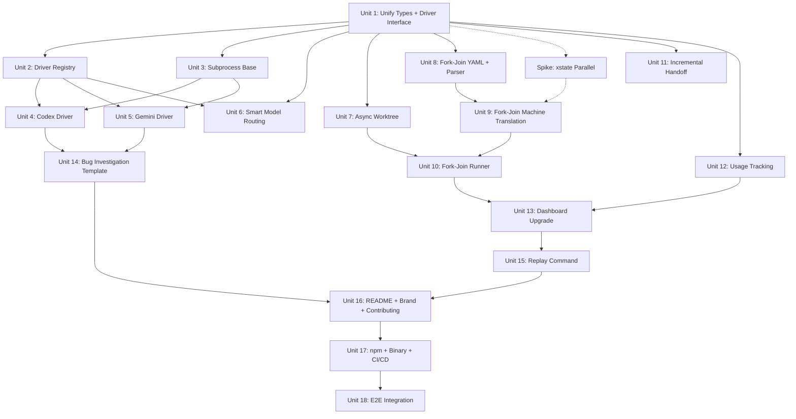

# feat: Maestro M2 — Multi-Driver, Parallel Execution & Competitive Release

> 实现状态：当前代码库已部分实现 M2，仍处于活跃阶段。多 driver、model routing、async worktree、retry handoff、usage 字段、replay、report、fork/join 状态机支持已经存在。generic driver、npm/CI 发布、默认 Ink dashboard 接入、复杂并行 handoff 的生产级稳定性仍待完成。当前进度请以 `docs/roadmap.md` 为准。

## Overview

Evolve Maestro from an internal-use M1 engine (Claude Code only, serial execution) to a public-ready M2 release with multi-driver support, parallel execution, smart model routing, incremental handoff, usage tracking, and brand positioning as the "Paradigm-as-Code" category leader. This plan is driven by competitive pressure from Hermes Agent (24k+ stars, 200+ model support) and the strategic decision to deepen Maestro's R&D orchestration niche rather than pursue general-purpose agent capabilities.

## Problem Frame

M1 Maestro works but has three competitive liabilities: (1) only supports Claude Code as a driver, creating a vendor lock-in perception against Hermes's 200+ model support; (2) only supports serial phase execution, underutilizing the structured orchestration advantage; (3) has no public presence or brand positioning. M2 addresses all three while adding cost optimization (smart routing, usage tracking) and developer experience improvements (incremental handoff, new templates). (see origin: docs/brainstorms/2026-04-04-hermes-competitive-strategy-requirements.md)

## Requirements Trace

- R1. Multi-Driver: Claude Code + Codex + Gemini CLI (origin R1, roadmap R30)
- R2. Generic Driver: user-defined CLI command template — deferred to M2 end (origin R2, roadmap R31)
- R3. Parallel execution: fork-join YAML syntax (origin R3, roadmap R34)
- R4. Brand positioning: README + landing page defining "Paradigm-as-Code" (origin R4)
- R5. 3+ paradigm templates at release: TDD (M1, reuse) + Feature Dev (M1, reuse) + Bug Investigation (M2, new) (origin R5)
- R6. Competitive comparison doc: Maestro vs Hermes Agent (origin R6)
- R8. Contributing guide + paradigm scaffold (origin R8)
- R9. Git-native integration deepening: branch-per-run optional mode (origin R9)
- R10. Auditability: usage data in events.jsonl + run reports (origin R10, R14)
- R11. Smart model routing: per-phase model config in YAML (origin R11)
- R12. Incremental handoff: diff + feedback mode for retry loops (origin R12)
- R14. Usage tracking: token count + cost per phase (origin R14)
- R33. Full Ink Dashboard upgrade (roadmap R33)
- R35. `maestro replay` command (roadmap R35)
- R36-R38. npm publish + binary distribution + CI/CD (roadmap R36-R38)
- R39. README + Demo recording (roadmap R39)

## Scope Boundaries

- No general-purpose agent capabilities (multi-platform messaging, self-learning, personal memory) — Hermes's territory
- No 200+ model support — cover the 3 mainstream AI coding agents + generic CLI driver
- No Web UI Dashboard — M3 scope
- No paradigm registry CLI (`maestro install`) — M3 scope, M2 only provides contributing guide
- No knowledge base management in engine — continues to be agent-handled via prompts
- No `maestro_version` bump to "2" — M2 additions are backward-compatible YAML extensions (new optional fields)
- Generic Driver deferred to M2 end — extract from 3 concrete drivers, not designed upfront

## Context & Research

### Relevant Code and Patterns

- `src/driver/claude.ts` — Current driver: bare `async function* runAgent()` export, no interface. Uses Agent SDK `query()`. M2 must extract `AgentDriver` interface from this pattern.
- `src/driver/types.ts` — `AgentEvent` (output/complete/error variants) + `RunAgentOptions` (already has `model?: string`). **Critical: duplicate `AgentEvent` exists in `src/types.ts` with different fields** — must unify first.
- `src/engine/runner.ts` line 8 — Hard-coded `import { runAgent } from "../driver/claude.js"`. Must change to driver factory lookup using `AgentConfig.driver` field.
- `src/engine/types.ts` — `AgentConfig` already has `driver: string` field (defaults to "claude-code"). `PhaseConfig` needs `model?` and parallel fields.
- `src/engine/machine.ts` — Serial-only xstate v5 translation. Uses `fromPromise` actors + `always` transitions with guards. M2 parallel needs `type: "parallel"` compound states.
- `src/sandbox/handoff.ts` — `copyHandoff()` is file-level incremental (good), but `prompt.ts` passes full `{{previous_output}}` content (needs incremental mode for retries).
- `src/engine/runner.ts` — Single `lastPhaseWorktree`/`lastPhaseOutputContent` tracking — must change to `Map<phaseName, state>` for parallel support.
- `src/engine/logger.ts` — `createEventLogger()` factory pattern, JSONL append. `MaestroEvent.data` is `Record<string, unknown>` — flexible enough for usage data without schema change.
- Worktree operations in `src/sandbox/worktree.ts` use synchronous `execFileSync` — must async-ify for parallel execution.

### Institutional Learnings

- M1 plan explicitly deferred AgentDriver interface to M2: "The driver interface will be extracted in M2 when the second driver is introduced" (M1 plan, Key Decision #4)
- M1 plan confirmed Codex/Gemini will use subprocess spawning while Claude uses Agent SDK (M1 plan line 70)
- AgentEvent type duplication between `src/types.ts` and `src/driver/types.ts` is a known technical debt from M1

## Key Technical Decisions

- **Driver interface as function type, not class**: Match M1's functional factory pattern (`createWorktreeManager`, `createEventLogger`). Define `type AgentDriverFn = (prompt: string, workdir: string, options: RunAgentOptions) => AsyncGenerator<AgentEvent>`. Driver registry maps `driver` field string to factory functions. Rationale: simpler than class hierarchy, consistent with codebase style, async generators compose well.

- **Driver registry over dependency injection**: Create a `src/driver/registry.ts` that maps driver names to factory functions. Runner calls `getDriver(agentConfig.driver)` instead of hard-importing claude. Rationale: avoids import-time side effects, allows lazy loading of driver deps, easy to extend.

- **Subprocess driver base**: Codex and Gemini drivers share subprocess management (spawn, stdout parsing, signal forwarding, exit code handling). Extract a `createSubprocessDriver()` helper that both drivers use with per-driver configuration (command, args format, output parsing). Rationale: avoid duplicating spawn/signal/timeout logic.

- **Parallel syntax: `fork`/`join` phase types**: Instead of a `parallel: [A, B]` field on phases, introduce `fork` and `join` phase types. A `fork` phase lists child phases to run in parallel. A `join` phase (implicit or explicit) collects results when all fork children complete. Rationale: cleaner separation of concerns, works naturally with xstate's `type: "parallel"` compound states, and the YAML reads naturally.

- **Worktree async-ification**: Convert `execFileSync` calls to async `execFile` wrapper using `Bun.spawn()` + awaiting exit. Required for parallel phase execution; blocking git operations would serialize "parallel" phases. Rationale: parallel phases each need their own worktree concurrently.

- **Incremental handoff only in retry loops**: Full-output handoff remains the default for linear/fork transitions. Incremental mode (diff + feedback summary) activates only when a phase routes backward (retry). Rationale: first-time transitions need full context; retries benefit from concise feedback.

- **Usage tracking via existing event schema**: Add `tokensIn`, `tokensOut`, `costUsd`, `modelUsed` to `PHASE_COMPLETE` event's `data` field. No schema migration needed — `data` is already `Record<string, unknown>`. Report generator adds a cost summary section. Rationale: minimal change, backward compatible.

- **All usage fields optional on AgentEvent**: `costUsd`, `durationMs`, `tokensIn`, `tokensOut`, `modelUsed` must be optional (`?`) on `AgentEvent.complete`. Subprocess drivers (Codex, Gemini) cannot reliably provide cost/token data. Runner must use nullish checks before accessing these fields. Rationale: current M1 code (`event.costUsd.toFixed(4)`) would crash with subprocess drivers if fields are required.

- **Fork child failure semantics: fail-fast with sibling abort**: When any fork child fails, the fork parent immediately aborts all remaining siblings (via their AbortControllers) and transitions to `__FAILED`. This is an explicit design choice, not deferred to implementation. Rationale: partial fork completion is harder to reason about and recover from than clean fail-fast. xstate v5 parallel states do NOT auto-abort siblings on child error — this must be implemented via `sendParent` + parent-level guard.

- **xstate parallel feasibility spike before implementation**: A 2h spike must validate xstate v5 parallel states with dynamic `fromPromise` actors BEFORE Unit 9 begins. Key question: parallel state's `onDone` fires when ALL children reach final, but children use `invoke → onDone → final` internally, not the same `invoke → onDone → next` pattern as serial phases. If spike fails, fallback to Runner-level `Promise.all` orchestration (Units 9+10 merge into a single Runner-only unit). Go/no-go decision immediately after spike.

- **Logger write safety for parallel phases**: Add a write queue or mutex to EventLogger to prevent interleaved JSONL lines during concurrent phase execution. OS-level append atomicity (PIPE_BUF = 4KB on macOS) is insufficient for large event payloads. Rationale: parallel phases emit events concurrently.

- **No `maestro_version` bump**: M2 YAML extensions (`model`, `fork`/`join`) are optional fields. Existing v1 paradigm files continue to work unchanged on M2 engine. M2 paradigm files using new fields will NOT parse on M1 engine — this is a one-way forward compatibility. Version bump deferred until a breaking schema change is needed. Rationale: zero migration cost for existing users upgrading to M2.

## Open Questions

### Resolved During Planning

- **AgentEvent type duplication**: Will unify in Unit 1 — canonical definition in `src/driver/types.ts`, re-export from `src/types.ts`. The driver-layer version has `costUsd`/`durationMs` which is the superset.
- **Parallel YAML syntax**: Fork/join phase types chosen over `parallel: []` field. Reads more naturally, maps directly to xstate parallel compound states.
- **Generic Driver timing**: Deferred to M2 end after 3 concrete drivers establish the pattern. Prevents premature abstraction.

### Deferred to Implementation

- Exact Codex CLI command format, stdout encoding, and exit code semantics — requires spike (2h)
- Exact Gemini CLI (`gemini-cli` or `gemini code`) command format and output protocol — requires spike (2h)
- Optimal fork-join merge strategy: concatenate all child outputs vs structured merge — depends on real usage patterns
- Whether parallel worktree creation needs rate limiting to avoid git lock contention
- `maestro replay` command UX and event playback rendering — can be designed during implementation

## High-Level Technical Design

> *This illustrates the intended approach and is directional guidance for review, not implementation specification. The implementing agent should treat it as context, not code to reproduce.*

### Driver Architecture

```
┌─────────────────────────────────────────────────┐
│  src/driver/types.ts (canonical)                │
│  AgentEvent, RunAgentOptions, AgentDriverFn     │
└─────────────┬───────────────────────────────────┘
              │
┌─────────────▼───────────────────────────────────┐
│  src/driver/registry.ts                         │
│  registerDriver(name, factory)                  │
│  getDriver(name) → AgentDriverFn                │
│                                                 │
│  Built-in registrations:                        │
│    "claude-code" → createClaudeDriver()         │
│    "codex"       → createCodexDriver()          │
│    "gemini"      → createGeminiDriver()         │
│    "generic"     → createGenericDriver(config)  │
└──────┬──────────┬──────────────┬────────────────┘
       │          │              │
  ┌────▼────┐ ┌──▼──────┐ ┌────▼────────┐
  │ claude  │ │ codex   │ │ gemini      │
  │ .ts     │ │ .ts     │ │ .ts         │
  │ (SDK)   │ │ (spawn) │ │ (spawn)     │
  └─────────┘ └────┬────┘ └──────┬──────┘
                   │              │
              ┌────▼──────────────▼──────┐
              │ subprocess.ts (shared)   │
              │ spawn, stream, signal,   │
              │ exit code, timeout       │
              └──────────────────────────┘
```

### Fork-Join State Machine Translation

```
YAML:
  phases:
    Analyze:
      agent: Investigator
      next: ParallelFix          # → fork node

    ParallelFix:
      type: fork
      phases: [FixFrontend, FixBackend]
      next: Verify               # → join, then continue

    FixFrontend:
      agent: Engineer
      ...
    FixBackend:
      agent: Engineer
      ...

    Verify:
      agent: Reviewer
      ...

xstate translation:
  ┌──────────┐     ┌─────────────────────────┐     ┌────────┐
  │ Analyze  │────▶│ ParallelFix (parallel)  │────▶│ Verify │
  └──────────┘     │  ┌──────────────┐       │     └────────┘
                   │  │ FixFrontend  │       │
                   │  └──────────────┘       │
                   │  ┌──────────────┐       │
                   │  │ FixBackend   │       │
                   │  └──────────────┘       │
                   └─────────────────────────┘
                   (transitions when ALL children
                    reach final state)
```

### Incremental Handoff (Retry Mode)

```
First pass:              Retry pass:
┌──────────┐             ┌──────────┐
│ Execute  │             │ Review   │
│ output:  │             │ output:  │
│ full code│             │ feedback │
└────┬─────┘             └────┬─────┘
     │                        │
     ▼                        ▼
┌──────────┐             ┌──────────────────────┐
│ Review   │             │ Execute (retry)      │
│ receives:│             │ receives:            │
│ full code│             │ {{previous_output}}  │
└──────────┘             │   = diff summary     │
                         │   + review feedback  │
                         │   (NOT full output)  │
                         └──────────────────────┘
```

## Implementation Units

### Dependency Graph



Units 4, 5, 6, 7, 11, 12 can be developed in parallel after their dependencies are met.

---

### Phase 1: Architecture Foundation

- [ ] **Unit 1: Unify AgentEvent Types + Define AgentDriver Interface**

**Goal:** Resolve the AgentEvent type duplication between `src/types.ts` and `src/driver/types.ts`, and define the canonical `AgentDriverFn` type that all drivers must implement.

**Requirements:** R1 (foundation)

**Dependencies:** None

**Files:**
- Modify: `src/driver/types.ts` — canonical home for `AgentEvent`, `RunAgentOptions`, new `AgentDriverFn` type
- Modify: `src/types.ts` — remove duplicate `AgentEvent`, re-export from driver/types
- Modify: `src/engine/runner.ts` — update imports
- Modify: `src/driver/claude.ts` — conform to `AgentDriverFn` signature
- Test: `tests/driver/types.test.ts`

**Approach:**
- `AgentEvent` canonical definition in `src/driver/types.ts` with superset fields: `durationMs`, `costUsd`, `tokensIn?`, `tokensOut?`, `modelUsed?`
- `AgentDriverFn` type: `(prompt: string, workdir: string, options: RunAgentOptions) => AsyncGenerator<AgentEvent>`
- `src/types.ts` re-exports `AgentEvent` from `src/driver/types.ts` for backward compatibility
- Refactor `claude.ts` `runAgent` to match `AgentDriverFn` signature (should be minimal since it already matches)
- **All usage fields optional**: `costUsd?`, `durationMs?`, `tokensIn?`, `tokensOut?`, `modelUsed?` on `AgentEvent.complete` variant. Runner must use nullish checks (e.g., `event.costUsd?.toFixed(4) ?? "N/A"`) — current M1 code assumes these are always present and would crash with subprocess drivers
- Audit all Runner/Report references to `costUsd`/`durationMs` and add nullish guards

**Patterns to follow:**
- Existing type organization pattern in `src/engine/types.ts`
- Existing re-export pattern (if any) or simple `export { AgentEvent } from "./driver/types.js"`

**Test scenarios:**
- Happy path: `AgentDriverFn` type accepts claude driver's `runAgent` function without type errors
- Happy path: Importing `AgentEvent` from either `src/types.ts` or `src/driver/types.ts` yields the same type
- Edge case: `AgentEvent.complete` with all optional fields (tokensIn, tokensOut, modelUsed) — fields are accessible
- Edge case: `AgentEvent.complete` without optional fields — compiles fine (backward compatible)

**Verification:**
- `tsc --noEmit` passes with zero errors
- All existing tests still pass unchanged
- No duplicate type definitions remain

---

- [ ] **Unit 2: Driver Registry**

**Goal:** Create a driver registry that maps driver name strings to `AgentDriverFn` factories, and refactor the runner to use it instead of hard-importing claude.

**Requirements:** R1 (foundation)

**Dependencies:** Unit 1

**Files:**
- Create: `src/driver/registry.ts`
- Modify: `src/engine/runner.ts` — replace `import { runAgent } from "../driver/claude.js"` with registry lookup
- Test: `tests/driver/registry.test.ts`

**Approach:**
- `registerDriver(name: string, factory: () => AgentDriverFn)` — lazy factory to avoid import-time side effects
- `getDriver(name: string): AgentDriverFn` — throws descriptive error if driver not registered
- Built-in registrations: `"claude-code"` → claude driver factory
- Runner change: `const driver = getDriver(agent.driver)` then `for await (const event of driver(prompt, workdir, options))`
- Pre-check on startup: validate all agents reference registered drivers before pipeline starts (fail fast)

**Patterns to follow:**
- Existing factory pattern: `createEventLogger()`, `createWorktreeManager()`

**Test scenarios:**
- Happy path: Register "claude-code" driver, `getDriver("claude-code")` returns a callable function
- Error path: `getDriver("nonexistent")` throws descriptive error naming the unknown driver and listing available drivers
- Happy path: Register multiple drivers, each resolves independently
- Edge case: Register same name twice — last registration wins (or throws, decide during implementation)
- Integration: Runner uses registry to select claude driver for a paradigm with `driver: "claude-code"`

**Verification:**
- Runner no longer has hard-coded claude import
- All existing tests pass (claude driver registered by default)
- Unknown driver name produces actionable error message

---

### Phase 2: Multi-Driver Implementation

- [ ] **Unit 3: Subprocess Driver Base**

**Goal:** Create a shared subprocess management helper that Codex and Gemini drivers will use.

**Requirements:** R1 (multi-driver foundation)

**Dependencies:** Unit 1

**Files:**
- Create: `src/driver/subprocess.ts`
- Test: `tests/driver/subprocess.test.ts`

**Approach:**
- `createSubprocessDriver(config: SubprocessDriverConfig): AgentDriverFn`
- Config: `{ command: string, buildArgs: (prompt, workdir, options) => string[], parseOutput: (stdout) => AgentEvent[], parseCompletion: (exitCode, stdout, stderr) => AgentEvent }`
- Spawn via `Bun.spawn()`, stream stdout line-by-line, emit AgentEvent.output for each line
- AbortController support: on abort, `process.kill("SIGTERM")`, wait grace period, then `SIGKILL`
- Timeout: configurable per-invocation, wraps spawn in race with timeout
- Exit code handling: 0 = success, non-zero = error event with stderr content
- Token extraction: if stdout contains usage info (driver-specific parsing), populate tokensIn/tokensOut

**Patterns to follow:**
- `src/driver/claude.ts` event emission pattern (output → complete/error)
- AbortController pattern from `src/engine/runner.ts`

**Test scenarios:**
- Happy path: Spawn `echo "hello"` → receives output event "hello" + complete event with exit code 0
- Error path: Command not found → error event with descriptive message
- Error path: Process exits with non-zero code → error event with stderr content
- Edge case: AbortController abort → process receives SIGTERM, driver emits error event
- Edge case: Process produces no stdout → complete event with empty result
- Happy path: Timeout triggers → process killed, timeout error event emitted

**Verification:**
- Can spawn, stream, and terminate a real subprocess
- AbortController integration works for cancellation
- Error events contain enough info for debugging

---

- [ ] **Unit 4: Codex CLI Driver**

**Goal:** Implement the Codex CLI driver using the subprocess base.

**Requirements:** R1

**Dependencies:** Unit 2 (registry), Unit 3 (subprocess base)

**Files:**
- Create: `src/driver/codex.ts`
- Modify: `src/driver/registry.ts` — register "codex" driver
- Test: `tests/driver/codex.test.ts`

**Execution note:** Start with a 2h spike to verify Codex CLI subprocess interface (command format, stdout protocol, exit codes, model parameter). Document findings before implementing.

**Approach:**
- Use `createSubprocessDriver()` with Codex-specific config
- Command: `codex` (or `npx @openai/codex`) with appropriate flags for non-interactive mode
- Model parameter: map `options.model` to Codex's model flag
- Output parsing: Codex-specific stdout format → AgentEvent mapping
- Registration: `registerDriver("codex", () => createCodexDriver())`

**Patterns to follow:**
- `src/driver/claude.ts` structure (exports, error handling)
- Subprocess base from Unit 3

**Test scenarios:**
- Happy path: Codex driver registered and retrievable from registry
- Happy path: Driver produces output events from Codex stdout stream
- Error path: Codex CLI not installed → descriptive error with install instructions
- Edge case: Model parameter correctly forwarded to Codex CLI flags
- Happy path: Successful completion → complete event with result

**Verification:**
- `getDriver("codex")` returns a working driver function
- Driver can execute a simple prompt via Codex CLI in a test directory

---

- [ ] **Unit 5: Gemini CLI Driver**

**Goal:** Implement the Gemini CLI driver using the subprocess base.

**Requirements:** R1

**Dependencies:** Unit 2 (registry), Unit 3 (subprocess base)

**Files:**
- Create: `src/driver/gemini.ts`
- Modify: `src/driver/registry.ts` — register "gemini" driver
- Test: `tests/driver/gemini.test.ts`

**Execution note:** Start with a 2h spike to verify Gemini CLI subprocess interface (command name, flags, output format, model parameter). Document findings before implementing.

**Approach:**
- Use `createSubprocessDriver()` with Gemini-specific config
- Command: `gemini` CLI with appropriate flags for non-interactive/headless mode
- Model parameter: map to Gemini's model selection flag
- Output parsing: Gemini-specific stdout format → AgentEvent mapping
- Registration: `registerDriver("gemini", () => createGeminiDriver())`

**Patterns to follow:**
- `src/driver/codex.ts` (will be the closest reference)
- Subprocess base from Unit 3

**Test scenarios:**
- Happy path: Gemini driver registered and retrievable from registry
- Happy path: Driver produces output events from Gemini stdout stream
- Error path: Gemini CLI not installed → descriptive error with install instructions
- Edge case: Model parameter correctly forwarded to Gemini CLI flags
- Happy path: Successful completion → complete event with result

**Verification:**
- `getDriver("gemini")` returns a working driver function
- Driver can execute a simple prompt via Gemini CLI in a test directory

---

- [ ] **Unit 6: Smart Model Routing**

**Goal:** Add per-phase `model` configuration to YAML schema and thread it through to the driver.

**Requirements:** R11

**Dependencies:** Unit 1 (types), Unit 2 (registry)

**Files:**
- Modify: `src/engine/types.ts` — add `model?: string` to `PhaseConfig`
- Modify: `src/engine/parser.ts` — parse `model` field from phase YAML
- Modify: `src/engine/runner.ts` — pass `phase.model` (or agent default model) to driver options
- Test: `tests/engine/parser.test.ts` — add model parsing tests
- Test: `tests/engine/runner.test.ts` — add model routing tests

**Approach:**
- `PhaseConfig.model?: string` — optional, overrides agent-level default
- `AgentConfig.model?: string` — optional default model for all phases using this agent
- Resolution order: `phase.model ?? agent.model ?? undefined` (driver's own default)
- Parser reads `model` from both agent and phase YAML blocks
- Runner constructs `RunAgentOptions` with resolved model value
- No validation of model names — driver-specific, validated at runtime by the driver

**Patterns to follow:**
- Existing optional field parsing in `src/engine/parser.ts` (e.g., `timeout_s`, `max_retries`)

**Test scenarios:**
- Happy path: Phase with `model: "gpt-4o"` → RunAgentOptions.model is "gpt-4o"
- Happy path: Agent with `model: "claude-sonnet"`, phase without model → uses agent default
- Happy path: Agent with model, phase with different model → phase model wins
- Edge case: Neither agent nor phase has model → RunAgentOptions.model is undefined
- Happy path: YAML with model field parses correctly alongside existing fields

**Verification:**
- Model resolution chain works: phase > agent > undefined
- Existing paradigm files without model field continue to parse and run unchanged

---

### Phase 3: Parallel Execution

- [ ] **Unit 7: Async Worktree Operations**

**Goal:** Convert synchronous git worktree operations to async, required for parallel phase execution.

**Requirements:** R3 (foundation)

**Dependencies:** Unit 1

**Files:**
- Modify: `src/sandbox/worktree.ts` — replace `execFileSync` with async `Bun.spawn()` wrapper
- Modify: `src/sandbox/handoff.ts` — same async conversion
- Test: `tests/sandbox/worktree.test.ts` — update to async
- Test: `tests/sandbox/handoff.test.ts` — update to async

**Approach:**
- Create async helper: `async function execGit(...args): Promise<string>` using `Bun.spawn()` + await exit + read stdout
- Replace all `execFileSync("git", ...)` calls with `await execGit(...)`
- All public functions in `worktree.ts` and `handoff.ts` become async
- Runner already awaits these functions, so call sites need minimal change (add `await` where missing)

**Patterns to follow:**
- Existing `Bun.spawn()` usage in `src/driver/claude.ts` (if any) or standard Bun subprocess patterns

**Test scenarios:**
- Happy path: `createWorktree()` still creates a valid git worktree (now async)
- Happy path: `copyHandoff()` still correctly detects and copies changed files (now async)
- Happy path: `cleanupWorktrees()` still removes all run worktrees (now async)
- Edge case: Concurrent worktree creation for two different phases — no git lock contention
- Error path: Git command failure → async rejection with descriptive error

**Verification:**
- All existing worktree and handoff tests pass with async conversion
- No `execFileSync` remains in sandbox modules

---

- [ ] **Unit 8: Fork-Join YAML Syntax + Parser + Validator**

**Goal:** Extend the YAML schema to support `fork` phase type with parallel child phases, and update parser/validator.

**Requirements:** R3

**Dependencies:** Unit 1 (types only — no worktree dependency; parser/validator are pure functions)

**Files:**
- Modify: `src/engine/types.ts` — add `type?: "fork" | "final"` and `phases?: string[]` to `PhaseConfig`
- Modify: `src/engine/parser.ts` — parse fork phase type and phases list
- Modify: `src/engine/validator.ts` — validate fork phase references, ensure fork children exist, no nested forks
- Test: `tests/engine/parser.test.ts` — fork syntax parsing
- Test: `tests/engine/validator.test.ts` — fork validation rules

**Approach:**
- Fork phase: `{ type: "fork", phases: ["PhaseA", "PhaseB"], next: "JoinTarget" }`
- Fork children are regular phases that run in parallel, each must have `type: "final"` or `next` pointing to end
- Fork phase's `next` is the join target — transitions when ALL children reach final state
- Validator rules: fork children must exist as defined phases, no nested forks (M2 limitation), fork children cannot have `next_if` (simplification — conditional routing not supported inside parallel branches)
- No new `join` phase type needed — fork's `next` acts as implicit join

**Patterns to follow:**
- Existing validation patterns in `src/engine/validator.ts` (Tarjan SCC, reference checks)
- Existing phase type handling (`"final"` type)

**Test scenarios:**
- Happy path: Parse fork phase with 2 children and next target → ParadigmConfig has correct fork structure
- Edge case: Fork with 1 child → valid but warns (degenerates to serial)
- Error path: Fork references nonexistent child phase → validation error
- Error path: Fork child has `next_if` → validation error (not supported in parallel branches)
- Error path: Nested fork (fork child is also fork) → validation error
- Happy path: Fork children defined as regular phases with `type: "final"` → valid
- Edge case: Fork with `next` pointing to nonexistent phase → validation error
- Integration: Full paradigm with both serial and fork phases → parses and validates

**Verification:**
- Parser correctly distinguishes fork phases from regular phases
- Validator catches all invalid fork configurations
- Existing paradigm files without fork phases continue to parse unchanged

---

- [ ] **Unit 9: Fork-Join xstate Machine Translation**

**Goal:** Extend the xstate state machine translator to generate parallel compound states for fork phases.

**Requirements:** R3

**Dependencies:** Unit 8, xstate parallel spike (must complete with go decision before this unit starts)

**Files:**
- Modify: `src/engine/machine.ts` — handle fork phases as xstate parallel states
- Test: `tests/engine/machine.test.ts` — parallel state transition tests

**Execution note:** This unit MUST NOT start until the xstate parallel spike (2h, run during Phase 1) produces a go decision. If spike result is no-go, this unit and Unit 10 merge into a single Runner-level Promise.all implementation.

**Approach:**
- Fork phase → xstate state with `type: "parallel"`, containing child states (one per fork child phase)
- Each child state: `invoke → onDone → final` (NOT the serial `invoke → onDone → next` pattern — parallel children must reach their own final state for the parent to complete)
- Parent parallel state `onDone` fires when ALL children reach final → transitions to fork's `next` target
- Fork child failure: child error triggers `sendParent` event → parent-level guard aborts remaining siblings via shared context flag → parent transitions to `__FAILED`
- Fork phase output: aggregate all children's outputs via `MachineContext.parallelOutputs: Record<string, PhaseOutput>`
- `MachineContext` extension: `parallelOutputs`, `forkAborted: boolean` flag

**Patterns to follow:**
- Existing `translateToMachine()` structure in `src/engine/machine.ts`
- xstate v5 parallel state documentation

**Test scenarios:**
- Happy path: Fork with 2 children → both invoke actors run, parallel state completes when both finish
- Happy path: Fork followed by serial phase → transition to serial phase after fork completes
- Edge case: One fork child fails → parallel state enters failure (how? — depends on xstate parallel semantics, may need custom handling)
- Edge case: Fork with 3 children, varying completion times → waits for slowest
- Integration: Mixed paradigm (serial → fork → serial → conditional) → correct state machine topology

**Verification:**
- Generated machine correctly models parallel execution semantics
- Fork-join transitions work with stub actors

---

- [ ] **Unit 10: Fork-Join Runner Orchestration**

**Goal:** Update the runner to handle parallel phase execution with multi-path worktree and handoff management.

**Requirements:** R3

**Dependencies:** Unit 7 (async worktree), Unit 9 (machine translation)

**Files:**
- Modify: `src/engine/runner.ts` — parallel actor injection, multi-path handoff, output aggregation
- Test: `tests/engine/runner.test.ts` — parallel execution tests

**Approach:**
- Replace single `lastPhaseWorktree`/`lastPhaseOutputContent` with `Map<string, PhaseState>` where `PhaseState = { worktree: string, outputContent: string }`
- Fork phase actor: spawns all child phase actors concurrently (Promise.all with individual timeouts)
- Each child gets its own worktree, handoff from the phase that precedes the fork
- Join: collect all child outputs, concatenate (or merge) into `lastPhaseOutputContent` for the next serial phase
- Event emission: `FORK_START`, `FORK_CHILD_START`, `FORK_CHILD_COMPLETE`, `FORK_COMPLETE` events
- Timeout: per-child timeout + overall fork timeout (min of individual timeouts)
- AbortController: fork abort cancels all children

**Patterns to follow:**
- Existing serial phase execution pattern in `src/engine/runner.ts`
- Existing event emission pattern

**Test scenarios:**
- Happy path: Fork with 2 stub children → both execute concurrently, join produces aggregated output
- Happy path: Serial → fork → serial pipeline → correct handoff chain
- Error path: One fork child fails → entire fork fails, other children aborted
- Edge case: Fork child timeout → child fails, fork fails
- Edge case: Ctrl-C during fork → all children and their worktrees cleaned up
- Integration: Fork events (FORK_START, FORK_CHILD_*, FORK_COMPLETE) emitted in correct order

**Verification:**
- Parallel phases actually run concurrently (measurable by timing — two 1s stubs complete in ~1s, not ~2s)
- Handoff correctly propagates from pre-fork phase to all fork children
- Output aggregation produces combined result for post-fork phase

---

### Phase 4: Developer Experience

- [ ] **Unit 11: Incremental Handoff for Retry Loops**

**Goal:** When a phase routes backward (retry), pass only diff + feedback instead of full output, reducing prompt bloat.

**Requirements:** R12

**Dependencies:** Unit 1

**Files:**
- Modify: `src/sandbox/handoff.ts` — add `generateDiffSummary()` function
- Modify: `src/sandbox/prompt.ts` — add incremental mode for `{{previous_output}}`
- Modify: `src/engine/runner.ts` — detect retry (backward transition) and switch to incremental handoff
- Test: `tests/sandbox/handoff.test.ts` — diff summary tests
- Test: `tests/sandbox/prompt.test.ts` — incremental mode tests

**Approach:**
- `generateDiffSummary(worktreePath): string` — runs `git diff --stat` + `git diff` (limited to first N lines) to produce a human-readable summary of changes made in this phase
- Incremental `{{previous_output}}` content: `## Review Feedback\n{review output}\n\n## Changes Made (diff summary)\n{diff summary}`
- Retry detection in runner: if the target phase has been executed before (retry counter > 0), use incremental mode
- Configurable diff size limit: max 50KB of diff content, truncate with "... (truncated, see worktree for full diff)"

**Patterns to follow:**
- Existing `copyHandoff()` git command pattern
- Existing prompt interpolation in `src/sandbox/prompt.ts`

**Test scenarios:**
- Happy path: First execution → full `{{previous_output}}` (unchanged behavior)
- Happy path: Retry execution → incremental `{{previous_output}}` with diff + feedback
- Edge case: Large diff exceeds 50KB → truncated with message
- Edge case: No changes in worktree (empty diff) → feedback-only content
- Edge case: First phase retry (no previous output) → still uses incremental with just feedback
- Happy path: Diff summary includes file names and change stats

**Verification:**
- Retry prompts are measurably shorter than full-output prompts
- Review feedback is always included in incremental handoff
- Diff summary provides enough context for the agent to understand what changed

---

- [ ] **Unit 12: Usage Tracking**

**Goal:** Record token consumption and cost per phase in event logs and run reports.

**Requirements:** R14, R10

**Dependencies:** Unit 1

**Files:**
- Modify: `src/driver/claude.ts` — extract token counts from Agent SDK response
- Modify: `src/driver/subprocess.ts` — parse token info from stdout if available
- Modify: `src/engine/runner.ts` — include usage data in PHASE_COMPLETE events
- Modify: `src/engine/report.ts` — add cost summary section to run reports
- Test: `tests/driver/claude.test.ts` — token extraction tests
- Test: `tests/engine/report.test.ts` — cost summary tests

**Approach:**
- Claude driver: Agent SDK's `ResultMessage` may include usage metadata — extract `tokensIn`, `tokensOut`, `costUsd`
- Subprocess drivers: parse stdout for usage patterns (model-specific), fallback to estimating from prompt/response length
- Runner: accumulate `PhaseUsage = { tokensIn, tokensOut, costUsd, modelUsed }` and include in `PHASE_COMPLETE` event data
- Report: new "Cost Summary" section with per-phase breakdown + total. Format: `| Phase | Model | Tokens In | Tokens Out | Cost |`
- `maestro stats` command (future): can aggregate across multiple run reports. M2 scope is per-run reporting only.

**Patterns to follow:**
- Existing event data pattern: `emit({ type: "PHASE_COMPLETE", phase: name, data: { status, ...usageData } })`
- Existing report generation in `src/engine/report.ts`

**Test scenarios:**
- Happy path: Claude driver extracts token counts from Agent SDK response → complete event has tokensIn/tokensOut
- Happy path: Report includes cost summary table with per-phase breakdown
- Edge case: Driver returns no usage data (e.g., subprocess with unparseable output) → report shows "N/A" for that phase
- Happy path: Total cost is sum of all phase costs
- Edge case: Retry phases have separate usage entries (not merged)

**Verification:**
- events.jsonl PHASE_COMPLETE entries include usage data when available
- Run report has a readable cost summary section

---

- [ ] **Unit 13: Full Ink Dashboard Upgrade**

**Goal:** Upgrade the terminal UI to a 3-panel layout with enhanced status display, parallel phase support, and usage info.

**Requirements:** R33

**Dependencies:** Unit 10 (parallel support), Unit 12 (usage data)

**Files:**
- Modify: `src/dashboard/app.tsx` — 3-panel layout, fork visualization
- Modify: `src/dashboard/phase-list.tsx` — indented fork children, parallel progress
- Create: `src/dashboard/event-timeline.tsx` — event timeline panel
- Modify: `src/dashboard/output-panel.tsx` — multi-agent output tabs for parallel phases
- Test: `tests/dashboard/app.test.tsx` — updated rendering tests

**Approach:**
- 3-panel layout: phase status (left), agent output (center), event timeline (right)
- Fork visualization: fork phases show indented children with parallel progress bars
- Multi-agent output: during fork execution, show tabbed output (one tab per parallel child)
- Event timeline: scrolling list of recent events with timestamps and phase names
- Usage display: show token count and cost next to completed phase names
- Use Ink's `<Box flexDirection="row">` for horizontal layout

**Patterns to follow:**
- Existing Ink component patterns in `src/dashboard/`
- Existing `useReducer` event dispatch pattern

**Test scenarios:**
- Happy path: 3-panel layout renders without overflow in standard terminal width (80 cols)
- Happy path: Fork phase shows indented children with correct status icons
- Happy path: Parallel execution shows multi-tab output
- Edge case: Terminal too narrow for 3 panels → graceful degradation to 2 panels
- Happy path: Usage info displayed next to completed phases

**Verification:**
- Dashboard renders correctly for both serial and parallel paradigms
- No visual artifacts or overflow in standard terminal sizes

---

- [ ] **Unit 14: Bug Investigation Paradigm Template**

**Goal:** Create a new paradigm template for systematic bug investigation workflows.

**Requirements:** R5

**Dependencies:** Unit 4, Unit 5 (drivers available for template testing)

**Files:**
- Create: `paradigms/bug-investigation.yaml`
- Create: `prompts/reproduce.md`
- Create: `prompts/diagnose.md`
- Create: `prompts/fix-bug.md`
- Create: `prompts/verify-fix.md`
- Test: paradigm validation via `maestro run --dry-run`

**Approach:**
- 4-phase workflow: Reproduce → Diagnose → Fix → Verify
- Reproduce: agent tries to reproduce the bug from description, creates failing test
- Diagnose: agent analyzes code to find root cause, writes diagnosis
- Fix: agent implements the fix
- Verify: agent runs tests, reviews fix quality. `next_if: verified → Done, failed → Fix` with max_retries: 2
- Each prompt instructs the agent on output_file format with appropriate status values
- Template demonstrates multi-driver capability (default agents use claude-code, but easily switchable)

**Test scenarios:**
- Happy path: `maestro run --dry-run paradigms/bug-investigation.yaml` passes validation
- Happy path: All prompt files exist and contain {{task}} and {{previous_output}} placeholders
- Happy path: Verify phase has next_if with verified/failed routing

**Verification:**
- Paradigm validates without errors
- Workflow makes logical sense for bug investigation use case

---

- [ ] **Unit 15: Replay Command**

**Goal:** Implement `maestro replay` to visualize historical run events.

**Requirements:** R35

**Dependencies:** Unit 13 (dashboard)

**Files:**
- Create: `src/cli/replay.ts`
- Modify: `src/index.ts` — register `replay` subcommand
- Test: `tests/cli/replay.test.ts`

**Approach:**
- `maestro replay <events.jsonl>` — reads an events file and replays events through the Ink dashboard
- Playback speed: `--speed 1x` (real-time), `--speed 2x`, `--speed 10x`, `--speed max` (instant)
- Pause/resume with spacebar
- Reuse existing dashboard components — feed events from file instead of live pipeline
- Show timestamps and phase durations as they were recorded

**Patterns to follow:**
- Existing CLI command registration in `src/cli/run.ts`
- Existing dashboard event consumption pattern

**Test scenarios:**
- Happy path: Replay a valid events.jsonl → dashboard shows phases completing in recorded order
- Error path: File not found → descriptive error
- Error path: Malformed JSONL line → skip with warning, continue replay
- Edge case: Empty events file → show "No events recorded" message
- Happy path: Speed multiplier affects playback timing

**Verification:**
- Can replay any M1/M2 events.jsonl file
- Dashboard renders correctly during replay

---

### Phase 5: Release Preparation

- [ ] **Unit 16: README + Brand Positioning + Contributing Guide**

**Goal:** Create public-facing documentation that defines the "Paradigm-as-Code" category and enables community contributions.

**Requirements:** R4, R6, R8, R39

**Dependencies:** Unit 14 (templates complete), Unit 15 (replay complete)

**Files:**
- Modify: `README.md` — complete rewrite for public release
- Create: `CONTRIBUTING.md` — paradigm contribution guide + scaffold instructions
- Create: `docs/comparison-hermes.md` — Maestro vs Hermes Agent comparison

**Approach:**
- README structure: tagline ("Paradigm-as-Code: encode R&D methodologies as executable state machines"), quick start, feature highlights (multi-driver, parallel execution, git-native, auditable), paradigm examples, comparison table vs alternatives
- CONTRIBUTING.md: how to write a paradigm (YAML schema reference), paradigm template scaffold (`maestro new-paradigm <name>`), how to add a driver, code conventions
- Comparison doc: clear "when to use Maestro" vs "when to use Hermes" framing. Not attack positioning — respect differentiation.
- Demo recording: asciinema or terminal GIF showing `maestro run combined-workflow.yaml --task "Add auth"` completing all phases

**Test expectation:** none — documentation only

**Verification:**
- README is clear, accurate, and positions Paradigm-as-Code as the category
- CONTRIBUTING.md is sufficient for an external contributor to create a paradigm template
- Comparison doc is fair and helps users choose the right tool

---

- [ ] **Unit 17: npm Publish + Binary Distribution + CI/CD**

**Goal:** Set up npm package publication, cross-platform binary builds, and enhanced CI/CD.

**Requirements:** R36, R37, R38

**Dependencies:** Unit 16

**Files:**
- Modify: `package.json` — npm publish config (name, version, bin, files)
- Modify: `.github/workflows/release.yml` — npm publish step
- Modify: `.github/workflows/ci.yml` — add lint, test coverage

**Approach:**
- npm package name: decide during implementation (check availability of `maestro-cli`, `maestro-dev`, `@maestro/cli`)
- `bin` field in package.json: `{ "maestro": "./dist/index.js" }`
- Binary builds: already in release.yml for 4 targets (linux-x64/arm64, darwin-x64/arm64)
- Add npm publish step: `npm publish` on tag push (after binary build succeeds)
- CI enhancement: add typecheck (`tsc --noEmit`), test coverage threshold
- Pre-publish validation: ensure all paradigm templates pass dry-run

**Test expectation:** none — CI/CD configuration

**Verification:**
- `npm pack` produces a valid package with correct files
- Release workflow publishes to npm on tag push
- Binary builds succeed for all 4 targets

---

- [ ] **Unit 18: End-to-End Integration**

**Goal:** Verify the complete M2 feature set works together in realistic scenarios.

**Requirements:** All M2 requirements

**Dependencies:** All previous units

**Files:**
- Create: `tests/e2e/multi-driver.test.ts`
- Create: `tests/e2e/parallel-execution.test.ts`
- Create: `tests/e2e/usage-tracking.test.ts`
- Modify: `tests/e2e/combined-flow.test.ts` — add model routing test

**Approach:**
- Multi-driver: paradigm with phases using different drivers (claude-code + codex) → all phases complete
- Parallel execution: fork paradigm with 2 parallel phases → both run concurrently, join aggregates
- Usage tracking: run a paradigm → events.jsonl has token counts, report has cost summary
- Model routing: paradigm with per-phase model config → correct model passed to each driver
- Incremental handoff: paradigm with Review → Execute retry → second attempt prompt is shorter
- Bug investigation: `maestro run paradigms/bug-investigation.yaml --task "..."` completes the 4-phase flow

**Test scenarios:**
- Integration: Multi-driver paradigm completes all phases with different drivers
- Integration: Fork-join paradigm runs children in parallel (verified by timing)
- Integration: events.jsonl from multi-driver run contains driver-specific usage data
- Integration: Retry loop produces incremental handoff (prompt size comparison)
- Integration: bug-investigation paradigm completes the full Reproduce → Diagnose → Fix → Verify flow
- Integration: Ctrl-C during parallel execution cleans up all fork children

**Verification:**
- All M2 features work together without conflicts
- Event logging captures all new event types (fork, usage)
- Reports include all new sections (cost summary, parallel phase details)

## System-Wide Impact

- **Interaction graph:** CLI → Runner → {Machine, DriverRegistry, WorktreeManager, Logger} → Dashboard. New surface: DriverRegistry dispatches to Claude/Codex/Gemini/Generic drivers. Fork phases fan out through Runner to multiple concurrent Driver + Worktree instances.
- **Error propagation:** Driver errors → Runner catches → emits PHASE_FAILED → Machine routes. Fork child failure → all siblings aborted → FORK_FAILED → Machine transitions. Driver-not-found → fail fast at startup (pre-check). Unchanged: validation errors still short-circuit before Runner starts.
- **State lifecycle risks:** Parallel worktree creation may hit git lock contention — mitigated by async operations + separate branch detach. Fork abort must clean up all child worktrees — Runner tracks all active worktrees in a Set for cleanup. events.jsonl concurrent writes during parallel phases — mitigated by Logger serializing writes (already append-only).
- **API surface parity:** All 3 drivers must produce the same AgentEvent stream contract. Difference is only in how they obtain the data (SDK vs subprocess). Test: same paradigm, different drivers, events have consistent shape.
- **Unchanged invariants:** User's main git branch is never modified. All agent work in worktrees. YAML v1 paradigm files continue to work unchanged. events.jsonl format is additive (new fields in data, no structural change).

## Risks & Dependencies

| Risk | Likelihood | Impact | Mitigation |
|------|-----------|--------|------------|
| Codex CLI subprocess interface unstable or undocumented | Medium | High | 2h spike before implementation. If unworkable, deprioritize Codex driver and fast-track Generic Driver instead. |
| Gemini CLI subprocess interface unstable or undocumented | Medium | High | Same spike strategy. Gemini CLI is newer, may have less stable headless mode. |
| xstate v5 parallel states don't support dynamic actor injection | Medium | High | 2h spike during Phase 1 (not deferred to Unit 9). Go/no-go decision before Unit 9 starts. Fallback: merge Units 9+10 into Runner-level Promise.all orchestration. |
| Parallel worktree creation hits git lock contention | Medium | Medium | Async operations reduce window. If contention persists, serialize worktree creation with a semaphore then parallelize only agent execution. |
| Logger JSONL write interleaving during parallel phases | Medium | Medium | Add write queue or mutex to EventLogger. OS append atomicity (PIPE_BUF=4KB) insufficient for large event payloads. |
| npm package name collision (`maestro-cli` taken) | Medium | Low | Check availability early. Have alternatives ready: `maestro-dev`, `@maestro/cli`, `paradigm-maestro`. |
| Agent SDK token extraction API changes | Low | Medium | Pin Agent SDK version. Usage tracking gracefully handles missing data (shows "N/A"). |

## Phased Delivery

### Phase 1: Architecture Foundation (Units 1-2 + xstate Parallel Spike)
Foundation for everything else. Must land first. xstate parallel spike (2h) runs in parallel with Units 1-2 to produce go/no-go for Phase 3.

### Phase 2: Multi-Driver (Units 3-6)
Can partially parallelize: Units 4 and 5 are independent after Unit 3. Unit 6 is independent.

### Phase 3: Parallel Execution (Units 7-10)
Highest technical risk. Unit 7 (async worktree) and Unit 8 (YAML syntax) can start in parallel with Phase 2 — neither depends on drivers. Unit 8 depends only on Unit 1, not Unit 7. Units 9→10 are sequential and gated by spike go/no-go. If spike is no-go, Units 9+10 merge into a single Runner-level implementation.

### Phase 4: Developer Experience (Units 11-15)
Units 11 and 12 can start in parallel with Phase 3. Units 13-15 are sequential.

### Phase 5: Release Preparation (Units 16-18)
Final polish. Sequential: docs → publish → e2e.

## Sources & References

- **Origin document:** [docs/brainstorms/2026-04-04-hermes-competitive-strategy-requirements.md](docs/brainstorms/2026-04-04-hermes-competitive-strategy-requirements.md)
- **Roadmap document:** [docs/brainstorms/2026-04-03-maestro-roadmap-requirements.md](docs/brainstorms/2026-04-03-maestro-roadmap-requirements.md)
- **M1 plan:** [docs/plans/2026-04-03-001-feat-maestro-m1-engine-plan.md](docs/plans/2026-04-03-001-feat-maestro-m1-engine-plan.md)
- **Current driver:** `src/driver/claude.ts` — Agent SDK async generator pattern
- **Current runner:** `src/engine/runner.ts` — orchestration loop with hard-coded driver import
- **Current machine:** `src/engine/machine.ts` — serial-only xstate v5 translation
- **Current handoff:** `src/sandbox/handoff.ts` — file-level incremental copy
- **xstate v5 parallel states:** https://stately.ai/docs/parallel-states
- **Hermes Agent:** https://github.com/NousResearch/hermes-agent — competitive reference
